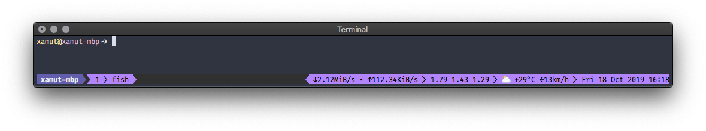

# Network bandwidth plugin for tmux
[](https://opensource.org/licenses/MIT)

Shows the network bandwidth in the status line.



## Installation
### Requirements
* awk (GNU awk)
* netstat
* numfmt

macOS: `brew install gawk coreutils`

Linux: `apt-get install gawk net-tools coreutils`

### With Tmux Plugin Manager
Add the plugin in `.tmux.conf`:
```
set -g @plugin 'xamut/tmux-network-bandwidth'
```
Press `prefix + I` to fetch the plugin and source it. Done.

### Manual
Clone the repo somewhere. Add `run-shell` in `.tmux.conf`:

```
run-shell PATH_TO_REPO/tmux-network-bandwidth.tmux
```
NOTE: this line should be placed after `set-option -g status-right ...`.

Press `prefix + :` and type `source-file ~/.tmux.conf`. Done.

## Usage
Add `#{network_bandwidth}` somewhere in the right status line:
```
set-option -g status-right "#{network_bandwidth}"
```
then you will see the bandwidth in the status line: `↓3.5MiB/s • ↑134KiB/s`

## Customization
The plugin could be customized with:
* `set-option -g @tmux-network-bandwidth-padding 12` - Set up the fixed padding for the output.

## Other plugins
* [tmux-spotify](https://github.com/xamut/tmux-spotify)
* [tmux-weather](https://github.com/xamut/tmux-weather)

## License
tmux-network-bandwidth plugin is released under the [MIT License](https://opensource.org/licenses/MIT).
